# NYC Analytics

> Unified analytics platform on **Microsoft Fabric** integrating NYC Taxi mobility, OpenAQ air quality, World Bank GDP, ECB FX rates, and Open-Meteo weather data — built on a medallion architecture (Bronze → Silver → Gold) with Power BI dashboards on top.


[](docs/NYC%20Analytics.pdf)

---

## Overview

The platform answers **four cross-domain analytical questions**:

1. How does taxi traffic intensity relate to NYC air quality (PM2.5 / NO₂ / O₃)?
2. Which zones and times of day show the strongest link between taxi demand and pollution peaks?
3. What is average revenue per trip in USD vs EUR, and how does FX fluctuation affect it?
4. Over multiple years, do we see mobility / economic growth at the expense of environmental quality?

All five data sources land in a single Fabric workspace, are cleaned through PySpark notebooks, and surface in a 4-page Power BI report. Three external integrations sit on top: a Grafana weather dashboard backed by InfluxDB, a Telegram Great Expectations report bot, and a Power Automate flow that exports a monthly Gold slice to Dropbox and fans it out to e-mail + a mobile push.

---

## Dashboard previews

| Mobility | Air Quality |
|:---:|:---:|
| 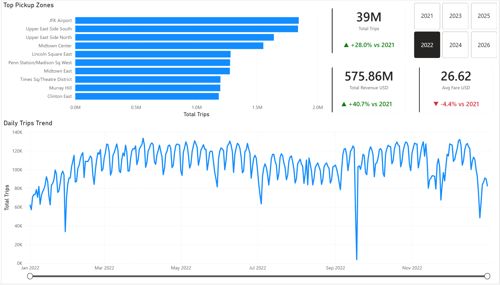 | 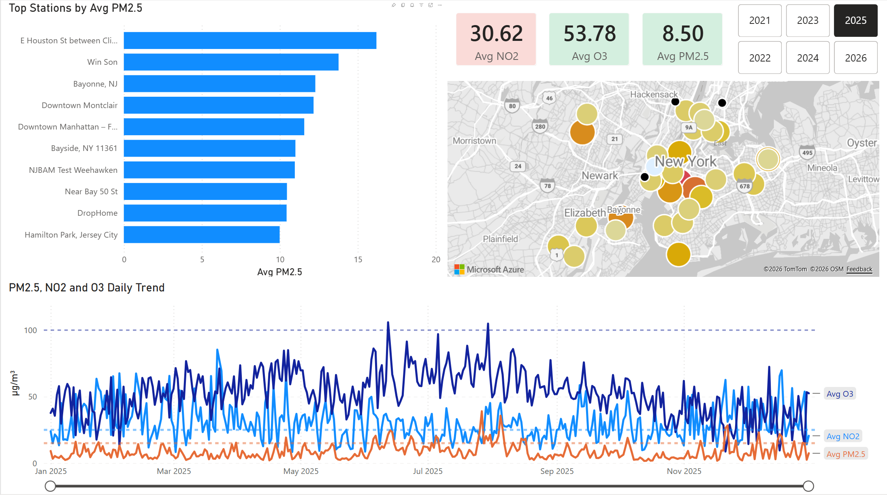 |
| **Correlation** | **Economic Impact** |
| 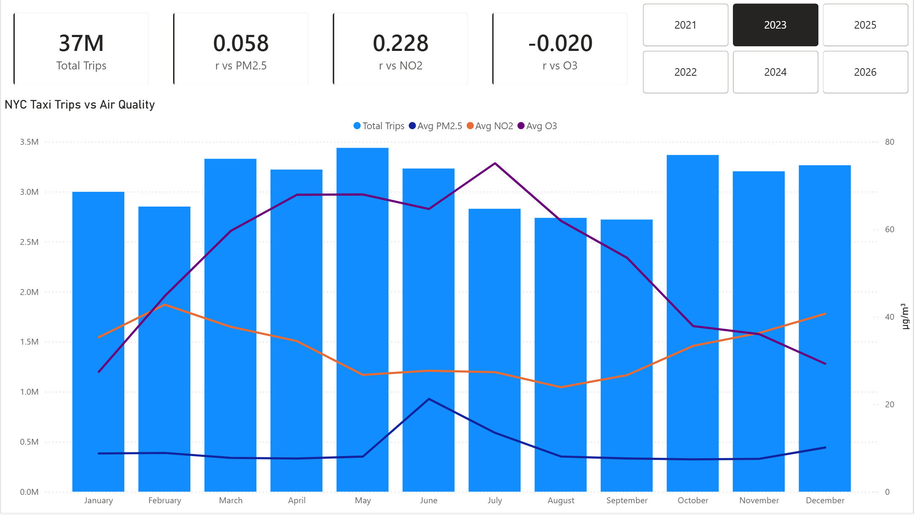 | 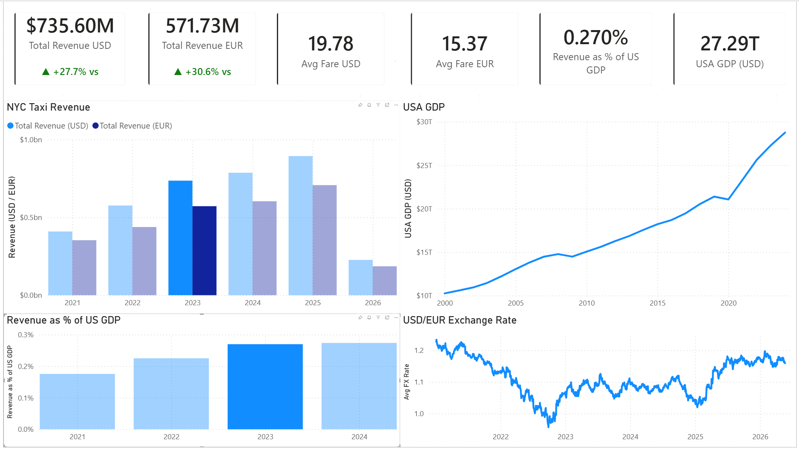 |

**Report (static PDF export): [`docs/NYC Analytics.pdf`](docs/NYC%20Analytics.pdf)** · visual breakdown in [`docs/architecture.md`](docs/architecture.md#power-bi-report-nyc-analytics).

---

## Architecture

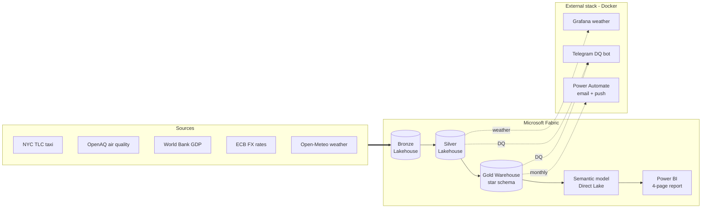
```mermaid
flowchart LR
    subgraph SRC[Sources]
        direction TB
        S1[NYC TLC taxi]
        S2[OpenAQ air quality]
        S3[World Bank GDP]
        S4[ECB FX rates]
        S5[Open-Meteo weather]
    end
    subgraph FAB[Microsoft Fabric]
        direction LR
        BRZ[(Bronze<br/>Lakehouse)]
        SLV[(Silver<br/>Lakehouse)]
        GLD[(Gold Warehouse<br/>star schema)]
        SM[Semantic model<br/>Direct Lake]
        PBI[Power BI<br/>4-page report]
        BRZ --> SLV --> GLD --> SM --> PBI
    end
    subgraph EXT[External stack - Docker]
        direction TB
        GRAF[Grafana weather]
        TG[Telegram DQ bot]
        PA[Power Automate<br/>email + push]
    end
    SRC ==> BRZ
    SLV -. weather .-> GRAF
    SLV -. DQ .-> TG
    GLD -. DQ .-> TG
    GLD -. monthly .-> PA
```

**The Fabric workspace — all platform items:**

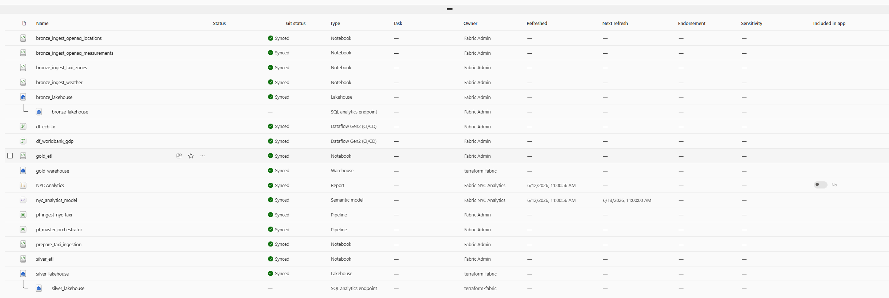

Architectural decisions (Why X over Y) documented in [`docs/architecture.md`](docs/architecture.md).

---

## Orchestration

A single Data Factory pipeline (`pl_master_orchestrator`) drives the whole platform — parallel Bronze ingestion + Dataflows, then Silver, then Gold — parameterised by year range and `force_refresh`. It runs both as a one-off **6-year backfill (2021–2026)** and as **twice-daily incremental loads** (MERGE on watermarks) — incremental mode reprocesses only recent partitions, so scheduled runs stay fast and light.

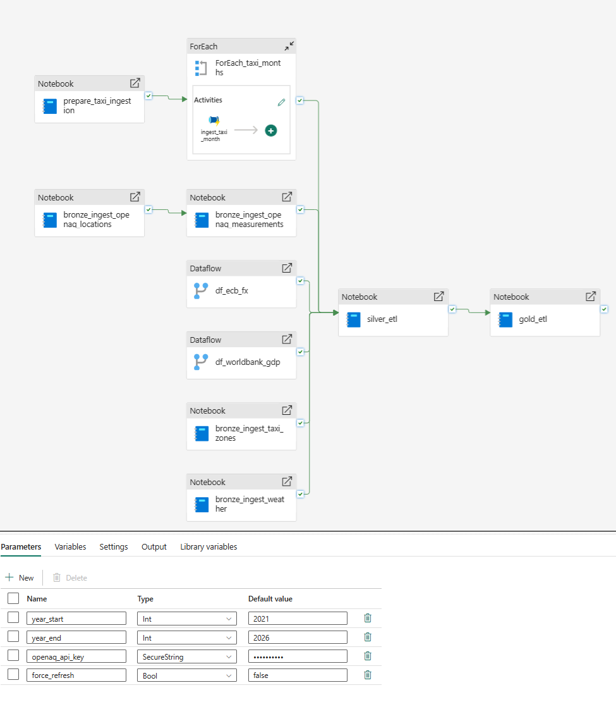

Run timings and incremental-mode behaviour: see [`docs/how_to_run.md`](docs/how_to_run.md).

---

## Data model & security

A **star schema** in the Fabric Warehouse, served through a **Direct Lake** semantic model. Row-Level Security restricts each dispatcher role to its own service zone.

**Star-schema semantic model**

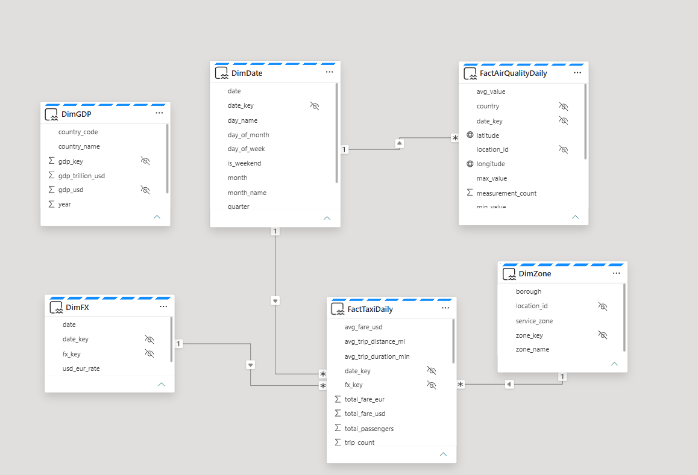

**Row-Level Security**

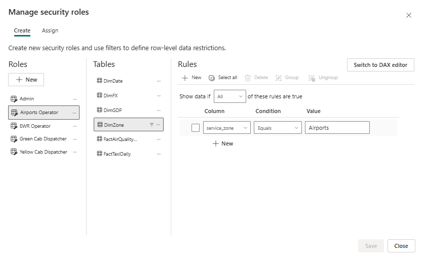

---

## External integrations (local Docker stack)

Three integrations read from the Fabric SQL endpoint and run locally via Docker Compose.

**Grafana — weather dashboard (InfluxDB)**

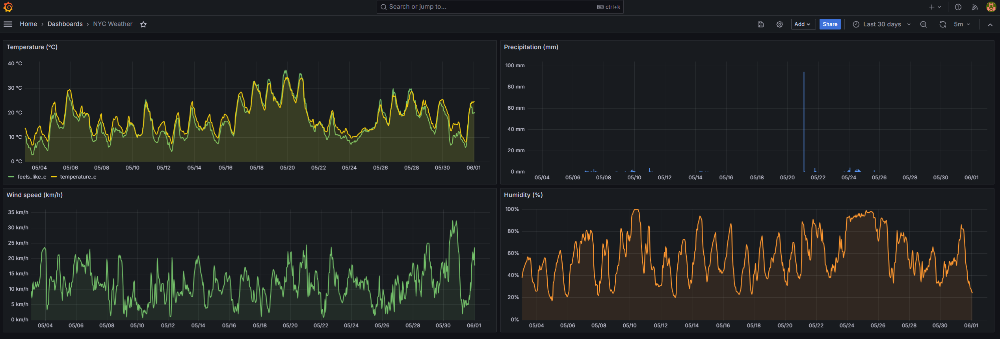

**Telegram — Great Expectations data-quality bot**

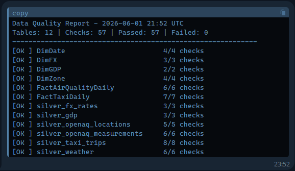

**Power Automate — monthly export (e-mail + mobile push)**

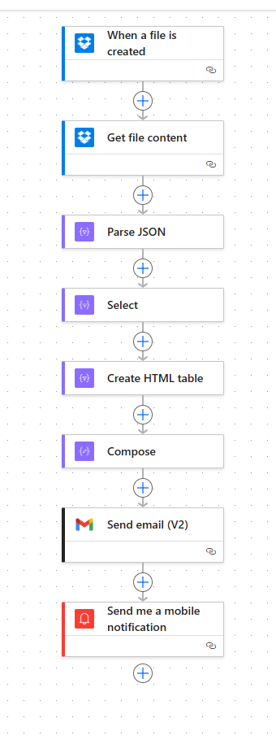

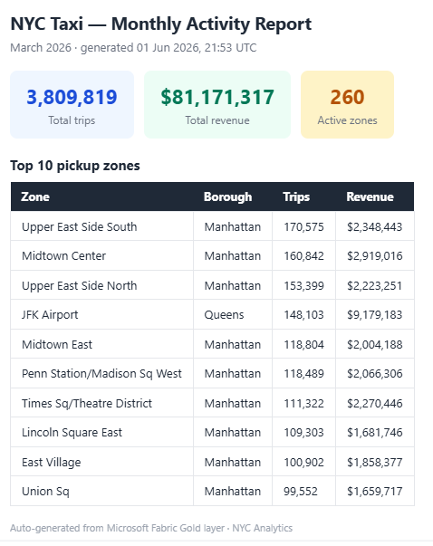

---

## Tech stack

| Layer | Tooling |
|---|---|
| Lakehouse / Warehouse | Microsoft Fabric (OneLake, Delta Lake, T-SQL) |
| ETL | PySpark notebooks, Data Factory pipelines, Dataflows Gen2 |
| Modeling | Star schema in Fabric Warehouse, Direct Lake semantic model |
| BI | Power BI (4 pages, DAX measures, RLS, Azure Maps) |
| IaC | Terraform (workspace, lakehouses, warehouse) |
| External stack | Docker Compose (InfluxDB + Grafana + Python app); Dropbox + Power Automate (e-mail + mobile push) |
| Data quality | Great Expectations + Telegram bot |
| CI | Fabric Git integration (notebook + report sync) |

---

## Data sources

| Source | Format | Ingestion tool | Frequency |
|---|---|---|---|
| NYC Taxi (TLC) | Parquet, monthly | Data Factory Pipeline (`pl_ingest_nyc_taxi`) | Monthly (~2-month lag) |
| OpenAQ Air Quality | JSON API + S3 archive | PySpark Notebook (`bronze_ingest_openaq_*`) | Daily |
| World Bank GDP | JSON API | Dataflow Gen2 (`df_worldbank_gdp`) | Yearly |
| ECB FX rates | CSV API | Dataflow Gen2 (`df_ecb_fx`) | Daily |
| Open-Meteo Weather | JSON API | PySpark Notebook (`bronze_ingest_weather`) | Hourly |

Full data dictionary: [`docs/data_dictionary.md`](docs/data_dictionary.md).

---

## Quick start

### Fabric

```bash
# Clone & push
git clone <repo>
cd nyc-analytics

# In Fabric UI: Workspace → Source control → Update all
# Then trigger the platform:
pl_master_orchestrator → Run
```

### Local stack (Docker)

```bash
make build           # build app image
make up              # start influxdb + grafana + app + telegram bot
make weather-sync-once   # one-shot Fabric → InfluxDB sync
make ge-report           # run Great Expectations, print report
make export-json         # export a Gold monthly slice → Dropbox (Power Automate trigger)
```

- Grafana: <http://localhost:3000>
- InfluxDB: <http://localhost:8086>
- Telegram bot: send `/report` to your configured bot
- Power Automate: `make export-json` → e-mail + mobile push for the latest month

Full setup (Service Principal, BotFather, `.env`): [`docs/how_to_run.md`](docs/how_to_run.md).

---

## Project structure

```
fabric/       Fabric workspace items — pipelines, dataflows, notebooks, warehouse, semantic model, Power BI report
              Synced via Fabric Git integration
app/          External Python CLI dispatcher (weather-sync, ge-report, Telegram bot)
              Single Docker image, three docker-compose services
terraform/    IaC: workspace, lakehouses, warehouse
grafana/      Provisioned datasource + dashboards
docs/         Architecture, data dictionary, how-to-run, screenshots, report PDF
Makefile      Compose + IaC shortcuts (`make help`)
```

---

## Documentation

| Question | Document |
|---|---|
| What's the architecture? Why this design? | [`docs/architecture.md`](docs/architecture.md) |
| What columns are in each table? | [`docs/data_dictionary.md`](docs/data_dictionary.md) |
| How do I run it end-to-end? | [`docs/how_to_run.md`](docs/how_to_run.md) |
| What Fabric items exist? | [`fabric/README.md`](fabric/README.md) |

---

## Key principles

- **Bronze is immutable** — raw data is never modified after landing
- **Silver owns cleaning** — all deduplication, normalization, and type casting happens here
- **Fabric is the source of truth** — external Docker stack reads from it; nothing flows back
- **Fail loudly** — pipelines raise on bad data instead of silent skips
- **Document decisions** — every non-obvious architectural choice has a "Why" entry in `docs/architecture.md`
