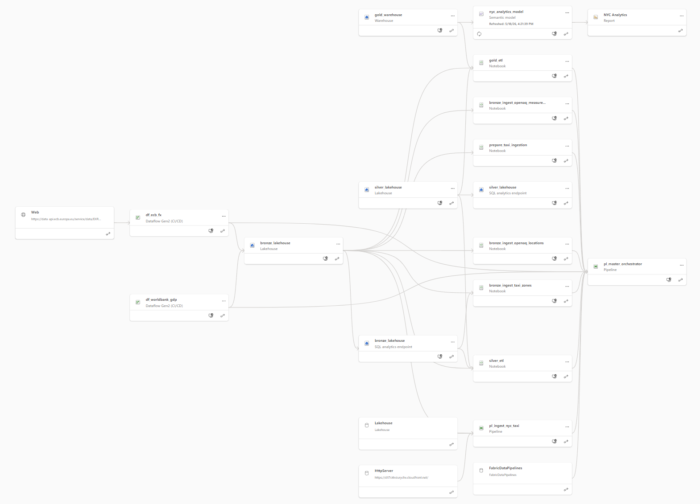

# Architecture Overview

## High-Level Diagram

```
+--------------------------- Microsoft Fabric Workspace ---------------------------+
|                                                                                  |
|  Sources         Bronze Lakehouse     Silver Lakehouse     Gold Warehouse        |
|  -------         ----------------     ----------------     --------------        |
|  NYC TLC      -> bronze_taxi_trips -> silver_taxi_trips -> FactTaxiDaily         |
|  OpenAQ API   -> bronze_openaq_*   -> silver_openaq_*   -> FactAirQualityDaily   |
|  World Bank   -> bronze_gdp        -> silver_gdp        -> DimGDP, DimDate       |
|  ECB CSV      -> bronze_fx_rates   -> silver_fx_rates   -> DimFX, DimZone        |
|  Open-Meteo   -> bronze_weather    -> silver_weather    --+                      |
|                                                           |                      |
|  Orchestration: pl_master_orchestrator (Data Factory)     |                      |
|  Star schema -> Power BI semantic model (Direct Lake)     |                      |
+-----------------------------------------------------------+----------------------+
                                                            v
                  +---------------- External Stack (Docker) -----------------+
                  |                                                          |
                  |  silver_weather -> InfluxDB -> Grafana dashboard         |
                  |  Silver + Gold  -> Great Expectations -> Telegram bot    |
                  |                                                          |
                  +----------------------------------------------------------+
```

---

## Components

### Microsoft Fabric Workspace
- **Name:** `Fabric NYC Analytics`
- **Capacity:** Fabric Trial (F64-equivalent, 60 days)
- **Region:** Poland Central
- **Provisioned via:** Terraform (`terraform/workspace.tf`)

### Terraform Infrastructure
- **Provider:** `microsoft/fabric` (~> 1.0)
- **Manages:** workspace, lakehouses (bronze, silver), warehouse (gold)
- **Does NOT manage:** Dataflow Gen2 definitions, Pipeline definitions, Notebook content (provider does not support these — synced via Fabric Git integration instead)
- **Auth mode (default):** Service Principal (`tenant_id`/`client_id`/`client_secret` in `terraform.tfvars`) — works on Fabric Trial and paid F-SKU
- **Auth mode (fallback):** Azure CLI (`use_cli = true`) — for quick local tests without an SP
- **Run:** `make -C terraform plan|apply|output`
- **Note:** `fabric/bronze_lakehouse.Lakehouse/`, `fabric/silver_lakehouse.Lakehouse/`, `fabric/gold_warehouse.Warehouse/` are auto-exported by Fabric Git for all workspace items — the actual resources are managed by Terraform, not these files.

### Lakehouse: Bronze
- **Purpose:** Raw landing zone — data is never modified after ingestion
- **Format:** Delta Lake (auto-created by Dataflow Gen2 and Pipeline)
- **Tables:**
  - `bronze_taxi_trips` — raw Parquet loaded from TLC (via Pipeline)
  - `bronze_openaq_locations` — OpenAQ location metadata (24k+ global stations) via `bronze_ingest_openaq_locations` Notebook (replaced Dataflow Gen2 for API key security)
  - `bronze_openaq_measurements` — OpenAQ pollutant readings for 22 NYC stations, last 5 years, via PySpark Notebook reading public S3 archive
  - `bronze_gdp` — World Bank yearly GDP per country via Dataflow Gen2
  - `bronze_fx_rates` — ECB daily USD/EUR rates via Dataflow Gen2
  - `bronze_taxi_zones` — TLC taxi zone lookup (~265 rows, static) via `bronze_ingest_taxi_zones` Notebook
  - `bronze_weather` — Open-Meteo hourly weather for NYC (single point) via `bronze_ingest_weather` Notebook; partitioned by year

### Lakehouse: Silver
- **Purpose:** Cleaned, deduplicated, schema-standardized data
- **Transformations applied:** see [fabric/silver_etl.Notebook/notebook-content.py](../fabric/silver_etl.Notebook/notebook-content.py)
- **Tables:**
  - `silver_taxi_trips` — renamed columns to snake_case, dropped nulls, deduped by (pickup_datetime, dropoff_datetime, pu_location_id, do_location_id, fare_amount), partitioned by year/month
  - `silver_openaq_locations` — location metadata, deduped by location_id, rows with null location_id or country_id dropped
  - `silver_openaq_measurements` — pollutant readings for NYC stations, value > 0, deduped by (location_id, parameter, datetime), partitioned by year/month; gas parameters (no2, o3, co, no, nox, so2) normalized from ppm to µg/m³ using EPA conversion factors at 25°C
  - `silver_gdp` — yearly GDP per country, nulls dropped, cast to correct types
  - `silver_fx_rates` — daily USD/EUR, deduped by date, nulls dropped
  - `silver_weather` — hourly NYC weather, datetime cast to timestamp, enriched column renames with explicit unit suffixes (`temperature_c`, `feels_like_c`, `precipitation_mm`, `wind_speed_kmh`, `humidity_pct`), derived `is_rainy` flag, partitioned by year/month; incremental MERGE on `(latitude, longitude, datetime)` with `whenMatchedUpdateAll` (Open-Meteo retroactively refines recent observations)

### Fabric Warehouse (Gold)
- **Purpose:** Analytical star schema optimized for reporting
- **Schema:** see [data_dictionary.md](data_dictionary.md)
- **Access:** SQL endpoint (T-SQL compatible)

### Data Factory
- **Pipeline:** `pl_ingest_nyc_taxi` — copies monthly Parquet files to Bronze; parameters: `year` (int), `month` (int); source URL and destination filename are dynamically built from parameters
- **Pipeline:** `pl_master_orchestrator` — single-entry-point orchestrator; parameters: `year_start` (int), `year_end` (int), `force_refresh` (bool); first runs `prepare_taxi_ingestion` (per-month source check + missing-file planning); on success, runs all ingestion in parallel — ForEach iterates only over months returned by prepare (skips not-yet-published months at source AND files already downloaded to bronze); then triggers silver_etl and gold_etl sequentially. All parallel activities depend on `prepare_taxi_ingestion` Succeeded for true fail-fast. **Schedule:** twice daily at 06:00 UTC and 18:00 UTC with `force_refresh=false`, `year_start=2021`, `year_end=<current year>` (update annually each January)
- **Dataflow Gen2:** `df_worldbank_gdp` — World Bank API → `bronze_gdp`; end year is dynamic (`DateTime.LocalNow() - 1`)
- **Dataflow Gen2:** `df_ecb_fx` — ECB CSV → `bronze_fx_rates` (full history, no date filter needed)

### Power BI Semantic Model
- **Item:** `fabric/nyc_analytics_model.SemanticModel/`
- **Storage mode:** Direct Lake on SQL (delegated identity mode, DirectQuery fallback enabled)
- **Source:** `gold_warehouse` SQL analytics endpoint
- **Tables:** DimDate, DimFX, DimGDP, DimZone, FactTaxiDaily, FactAirQualityDaily
- **Relationships:**
  - `FactTaxiDaily[date_key]` → `DimDate[date_key]` (Many:1, active)
  - `FactTaxiDaily[fx_key]` → `DimFX[fx_key]` (Many:1, active)
  - `FactTaxiDaily[zone_key]` → `DimZone[zone_key]` (Many:1, active)
  - `FactAirQualityDaily[date_key]` → `DimDate[date_key]` (Many:1, active)
  - `DimGDP` — no relationship (used as standalone context table)
- **DAX measures in FactTaxiDaily:** Total Trips, Total Revenue USD, Total Revenue EUR, Avg Fare USD, Avg Trip Distance (mi), Avg Trip Duration (min)
- **DAX measures in FactAirQualityDaily:** Avg PM2.5, Avg NO2, Avg O3
- **DAX measures in DimGDP:** USA GDP (USD) — `CALCULATE(MAX(DimGDP[gdp_usd]), DimGDP[country_code] = "US")`
- **Row-Level Security (RLS):** 5 static roles filtering `DimZone[service_zone]`, mapped to real NYC TLC licensing zones. Filter propagates to `FactTaxiDaily` via the existing `zone_key` relationship (single-direction). `FactAirQualityDaily` is not filtered (no zone relationship — air quality is station-based). All roles use `modelPermission: read`; workspace permissions (Admin/Member/Contributor bypass RLS — only Viewer respects it). Role-to-user assignment is done in Power BI Service after deployment.

  | Role | DAX filter on DimZone | Business context |
  |------|------------------------|------------------|
  | `Admin` | — (no filter) | Data team, leadership — full visibility |
  | `Yellow Cab Dispatcher` | `[service_zone] = "Yellow Zone"` | Manhattan medallion taxi operations |
  | `Green Cab Dispatcher` | `[service_zone] = "Boro Zone"` | Outer-borough green-cab operations |
  | `Airports Operator` | `[service_zone] = "Airports"` | JFK + LaGuardia airport team |
  | `EWR Operator` | `[service_zone] = "EWR"` | Newark (NJ) airport team |

### Power BI Report: NYC Analytics
- **Item:** `fabric/Mobility Dashboard.Report/`
- **Semantic model:** `nyc_analytics_model`
- **Pages:**
  - **Mobility** ([screenshot](img/powerbi_mobility.png)) — KPI cards with YoY change indicators (`▲ +X.X% vs prev year`, green/red conditional font color): Total Trips, Total Revenue USD, Avg Fare USD; year tile slicer, daily trips trend (line chart with range slider), top 10 pickup zones by trip count
  - **Air Quality** ([screenshot](img/powerbi_air_quality.png)) — KPI cards (Avg NO2, Avg O3, Avg PM2.5) with conditional fill color based on WHO 24h limits (green/yellow/red), year tile slicer, Azure Maps bubble visual (station coordinates, bubble size + gradient color by Avg PM2.5), combined PM2.5+NO2+O3 daily trend with WHO threshold reference lines (PM2.5=15, NO2=25, O3=100) and zoom slider, top 10 stations by Avg PM2.5
  - **Mobility & Air Quality Correlation** ([screenshot](img/powerbi_correlation.png)) — KPI cards: Total Trips, plus 3 Pearson correlation coefficient cards (`r vs PM2.5`, `r vs NO2`, `r vs O3`) computed via DAX `SUMMARIZE` + `SUMX` over `DimDate[date_key]`; year tile slicer; combo chart with Total Trips bars + PM2.5/NO2/O3 lines (monthly aggregation)
  - **Economic Impact** ([screenshot](img/powerbi_economic_impact.png)) — KPI cards with YoY indicators (Total Revenue USD, Total Revenue EUR), plus `% of US GDP` card and `USA GDP (USD)` card (latter year-aware via `COALESCE(SELECTEDVALUE(DimGDP[year]), SELECTEDVALUE(DimDate[year]))`); year tile slicer; clustered column chart (revenue USD vs EUR by year), line chart (USA GDP by year, 2000–2024), `Revenue as % of US GDP` bar chart by year (2021–2024 — World Bank GDP ends 2024), USD/EUR exchange rate line chart (filtered to 2021–2026 to match taxi window)

### Notebooks
All notebooks live in `fabric/` as Fabric Notebook items synced via Git integration. There is no separate `notebooks/` directory.
- `fabric/bronze_ingest_openaq_locations.Notebook/` — fetches all OpenAQ station metadata via API v3 (paginated) → `bronze_openaq_locations`; parameter: `openaq_api_key`; retries on transient 5xx/429/network errors
- `fabric/bronze_ingest_openaq_measurements.Notebook/` — reads OpenAQ public S3 archive for NYC stations (filtered by bounding box from `bronze_openaq_locations`) → `bronze_openaq_measurements`; parameters: `year_start`, `year_end`, `force_refresh` (bool). Default mode fetches only current + previous month from S3 (month-level prefix listing) and MERGEs into target on natural key `(location_id, sensors_id, datetime, parameter)`; `force_refresh=True` performs full year-range download with partition replacement
- `fabric/bronze_ingest_taxi_zones.Notebook/` — downloads TLC `taxi_zone_lookup.csv` → `bronze_taxi_zones` Delta table (~265 rows, static); no parameters
- `fabric/bronze_ingest_weather.Notebook/` — Open-Meteo hourly weather for NYC single point (Manhattan) → `bronze_weather`; parameters: `year_start`, `year_end`, `force_refresh` (bool). Default mode uses Forecast API `past_days=2` and MERGEs into target on `(latitude, longitude, datetime)`; `force_refresh=True` or first run uses Archive API for the full year range with partition replacement
- `fabric/prepare_taxi_ingestion.Notebook/` — pre-flight per-month HEAD check on TLC for each `(year, month)` in range + lists existing taxi files in bronze; outputs JSON list of months to download via `notebookutils.notebook.exit` for ForEach in `pl_master_orchestrator`; parameters: `year_start`, `year_end`, `force_refresh` (bool, default false). Treats HTTP 403/404 as "not yet published" and proceeds with available months; fails only if NO months in range are available at source. Enables incremental ingestion (skip already-downloaded files) and partial-year ingestion (download Jan-Mar 2026 even when later months aren't published)
- `fabric/silver_etl.Notebook/` — Bronze → Silver transformations (PySpark): all 5 data sources; parameters: `year_start`, `year_end`, `force_refresh` (bool). Default mode is incremental for `silver_openaq_measurements` (watermark `MAX(datetime)` + Delta `MERGE INTO`) and `silver_taxi_trips` (partition diff — append only `(year, month)` not yet in silver). `force_refresh=True` does full partition overwrite for the year range. Handles TLC Parquet schema drift via per-file normalisation: `Airport_fee` → `airport_fee` rename (capitalisation changed in 2026 files); explicit casts `VendorID`/`PULocationID`/`DOLocationID`/`payment_type` → long, `passenger_count`/`RatecodeID` → double (types changed across TLC file generations). Normalizes OpenAQ gas measurements from ppm to µg/m³
- `fabric/gold_etl.Notebook/` — Silver → Gold / Warehouse load (PySpark + synapsesql); parameters: `year_start`, `year_end`, `force_refresh` (bool). Default mode is incremental for `FactAirQualityDaily` and `FactTaxiDaily` — re-aggregates only dates from `MAX(gold.date_key) - LATE_ARRIVING_LOOKBACK_DAYS` (=7) forward to handle late-arriving silver data and short missed-run gaps. `force_refresh=True` does full rebuild for year range

### External Integrations

Two integrations layered on top of the medallion: (1) weather data flowing out of Fabric into a time-series database with a Grafana dashboard; (2) Great Expectations data-quality validation triggered on demand via a Telegram bot. Fabric remains the single source of truth — the external app reads from it, never the other way around.

**Implemented**
- **Weather flow inside Fabric** — `bronze_ingest_weather` Notebook (Open-Meteo Archive + Forecast → `bronze_weather`, NYC single point, hourly), `silver_etl` `## Weather` section (datetime cast, enriched column renames with explicit unit suffixes, derived `is_rainy` flag, partitioned by year/month, MERGE on watermark), `pl_master_orchestrator` runs weather as parallel ingestion and `silver_etl` depends on its success.
- **Entra ID Service Principal** — `nyc-analytics-app` registered; tenant setting "Service principals can call Fabric APIs" enabled; SP added to workspace as Viewer (covers Read on `silver_lakehouse` SQL endpoint and `gold_warehouse`).
- **External app** — `app/` package: `__main__.py` CLI dispatcher with `WEATHER_SYNC_INTERVAL_SECONDS` scheduler loop, `config.py` (env vars), `fabric_client.py` (pyodbc + SP auth), `influx_client.py`, `weather_sync.py`, `bot.py`, `ge/` subpackage. Single Docker image (`python:3.11-slim` + MS ODBC Driver 18). `requirements.txt`: `influxdb-client`, `pyodbc`, `python-dotenv`, `great-expectations`, `pandas`, `python-telegram-bot`.
- **`app/weather_sync.py`** — watermark from InfluxDB `last(_time)` of `weather` measurement, T-SQL incremental `WHERE datetime > watermark` against `silver_weather`, single batched write of Points (tag `location=nyc`, fields temperature_c / feels_like_c / precipitation_mm / wind_speed_kmh / humidity_pct / weather_code / is_rainy). Verified end-to-end: 47,112 historical hourly Points written to bucket `weather_nyc`.
- **`app/ge/`** — Great Expectations runner for 12 Silver + Gold tables, 56 expectations total. Hybrid execution: small tables (~hundreds–tens of thousands of rows) use GE PandasDataset with an ephemeral context; large tables (`silver_taxi_trips` ~201M rows, `silver_openaq_measurements` ~2M, `FactTaxiDaily`, `FactAirQualityDaily`) use SQL-aggregate checks wrapped in the same `CheckResult` shape. `format_report()` produces a monospace text report suitable for Telegram. Per-suite try/except keeps a single failure from breaking the whole report.
- **`app/bot.py`** — Telegram bot via `python-telegram-bot` v21 in long-polling mode (`Application.run_polling()`). Commands: `/start` (welcome), `/report` (placeholder reply → `asyncio.to_thread(run_report)` so the blocking pyodbc/pandas/GE call doesn't freeze the event loop → final report HTML-escaped in `<pre>` block via `edit_text`). Optional `TELEGRAM_ALLOWED_CHAT_IDS` allowlist; empty = open access.
- **`docker-compose.yml`** — services `influxdb` (OSS 2.7, persistent volume, `DOCKER_INFLUXDB_INIT_*` bootstrap, unlimited retention, `influx ping` healthcheck), `grafana` (OSS 11.2, waits on influxdb healthy, mounts `grafana/provisioning/` read-only), `app-weather-sync` (builds local Dockerfile, env_file `.env`, `WEATHER_SYNC_INTERVAL_SECONDS=3600` for hourly loop), `app-bot` (reuses the image, `python -m app bot`, `restart: unless-stopped`).
- **`grafana/provisioning/`** — `datasources/influxdb.yml` (uid=`influxdb`, Flux mode, secure token from env) + `dashboards/dashboards.yml` (file provider) + `dashboards/weather.json` (4-panel NYC Weather: temperature, precipitation, wind, humidity). Auto-loaded at Grafana start.
- **`Makefile`** — compose lifecycle (up / up-data / down / restart / stop / clean), build / rebuild, ps + per-service logs, `weather-sync-once` and `ge-report` for ad-hoc runs.
- **`docs/how_to_run.md` § Step 7** — end-to-end Phase 7 setup walkthrough: Service Principal registration, BotFather token, `.env` fill, `make build` + `make up`, Grafana on `localhost:3000`, `/report` in Telegram.

---

## Architectural Decisions

### Why boto3 for OpenAQ S3 ingestion (not Spark S3A)

Fabric Spark runs on Azure infrastructure with a hardcoded AWS credential provider chain
(`TemporaryAWSCredentialsProvider → SimpleAWSCredentialsProvider → EnvironmentVariableCredentialsProvider → IAMInstanceCredentialsProvider`).
`AnonymousAWSCredentialsProvider` cannot be injected — neither `spark.conf.set`,
`sc._jsc.hadoopConfiguration().set()`, nor `%%configure` override the chain after Fabric
initializes it. Therefore, native `spark.read.csv("s3a://...")` fails on public S3 buckets.
**Solution:** `boto3` with `Config(signature_version=UNSIGNED)` runs in the Python layer,
bypasses Spark's S3A entirely, and achieves anonymous access. Downloads are parallelized via
`ThreadPoolExecutor`, then converted to Spark DataFrames for Delta writes.

### Why `force_refresh` cascading parameter for incremental processing

For high-frequency scheduled runs (twice daily), full year rebuild of silver and gold (~10-15 min) is mostly redundant — only minimal new data arrives between runs. Incremental processing reduces typical run time to ~1-2 min.

**Design choice:** single `force_refresh` (bool) parameter on `pl_master_orchestrator`, cascaded to all relevant notebooks (`bronze_ingest_openaq_measurements`, `silver_etl`, `gold_etl`, `prepare_taxi_ingestion`). User-facing semantic: "I want to force a full rebuild" — default `False` = incremental (fast, schedule-friendly), `True` = full rebuild for manual backfill or recovery.

**Per-table incremental strategy:**
- `bronze_openaq_measurements` — fetch only current + previous month from S3 (month-level prefix listing), MERGE INTO on natural key
- `silver_openaq_measurements` — watermark `MAX(datetime)` + Delta `MERGE INTO`
- `silver_taxi_trips` — partition diff — process only files whose `(year, month)` not yet in silver, append new partitions
- `FactAirQualityDaily` / `FactTaxiDaily` — re-aggregate dates from `MAX(gold.date_key) - 7 days` (handles late-arriving silver data + short missed-run gaps via 7-day lookback)
- Other small tables (FX/GDP/locations/zones/all dims) — full overwrite each run (overhead exceeds savings)

**Alternatives considered:**
- Separate `incremental_mode` parameter per notebook — rejected: harder for users to reason about; force_refresh cascading is intuitive
- Two orchestrators (daily + monthly) — rejected per spec re-read: spec says "daily/hourly" not "daily AND monthly"; one orchestrator with idempotent prepare + incremental ETL works for any frequency
- Delta Change Data Feed (CDF) for change tracking — rejected as over-engineered for our scale

### Why Open-Meteo for Weather?
- Completely free, no API key, no rate limits for historical + forecast
- Returns hourly JSON with temperature, precipitation, windspeed, humidity, weather_code, apparent_temperature
- Two endpoints (Archive + Forecast) cover both backfill and incremental modes naturally
- Alternative: OpenWeatherMap (requires API key, limited free tier)

### Why InfluxDB for Weather Data?
- Native time-series storage: data is indexed by timestamp — queries like "avg temp per hour" are 10–100× faster than on a relational DB
- First-class Grafana integration (official data source plugin)
- Free cloud tier sufficient for this project's data volume
- Alternative considered: TimescaleDB (PostgreSQL extension) — more setup, less Grafana-native

### Why Grafana (not Power BI) for Weather?
- Power BI cannot connect to InfluxDB natively
- Grafana is the industry standard for time-series monitoring dashboards
- Demonstrates understanding of polyglot persistence (different DB for different use cases)

### Why Great Expectations?
- Industry-standard Python library for data quality validation
- Generates human-readable HTML reports and machine-readable JSON
- Supports both pandas and Spark backends
- Alternative: dbt tests — but dbt is harder to integrate with Fabric Notebooks

### Why Telegram / Discord Bot (not email)?
- Demonstrates event-driven / interactive data quality monitoring
- Low-latency: report arrives within seconds of command
- More engaging for a defense demo than "it sends an email"

### Zone-level air quality correlation — known limitation

OpenAQ sensor IDs and TLC taxi zone IDs are different geographic systems with no shared key. OpenAQ stations are identified by `location_id` (a global integer) with lat/lon coordinates; TLC zones are polygons referenced by `LocationID` (1–265). Joining them requires external geocoding (reverse geocode sensor lat/lon to a TLC zone polygon), which is not implemented.

As a result, `FactAirQualityDaily` cannot be directly joined to `FactTaxiDaily` at the zone level. The Correlation page shows city-wide aggregates (all stations averaged, all zones summed) — not zone-specific correlation. This is a known architectural constraint, not a bug.

### Why Gold uses read-filter-union-overwrite (not append)

Fabric Warehouse is written via `synapsesql`, which only supports `mode("overwrite")` (full truncate+insert) or `mode("append")`. Delta Lake `replaceWhere` is not available.

- **Append** is non-idempotent: re-running the orchestrator for the same year range duplicates every row.
- **Full overwrite** deletes all years except the current run range — running for 2024 would erase 2021–2023.
- **Read-filter-union-overwrite:** read the existing table, filter out rows in the target year range (the rows we're about to replace), union the fresh data in, write all rows back. This is idempotent (same result regardless of how many times run) and preserves all years outside the current range.

`DimDate` uses the same principle extended in the other direction: it reads the existing min/max year from the warehouse and extends the date spine to cover both the existing range and the new range, so no dates are lost on partial re-runs.

### Why Medallion (Bronze/Silver/Gold)?
- **Bronze** preserves raw data forever — allows re-processing if Silver logic changes
- **Silver** decouples cleaning from modeling — reusable by multiple Gold layers
- **Gold** is optimized for query performance, not storage efficiency
- Alternative considered: flat Lambda architecture — rejected due to higher operational complexity

### Why Dataflow Gen2 for APIs, Pipeline for Files?
- Dataflow Gen2 has native Power Query M for JSON/CSV transformations and pagination
- Data Factory Pipeline Copy Activity is optimized for large binary file transfers
- Mixing them would add unnecessary complexity

### Why Star Schema in Warehouse (not flat table)?
- Separates measures (facts) from descriptive attributes (dimensions)
- Enables additive aggregations across any dimension
- Power BI DAX measures work most efficiently against star schema
- Easier to extend: new fact table can reuse existing DimDate/DimZone

### Why Delta Lake for Bronze and Silver?
- ACID transactions prevent partial writes on pipeline failure
- Time Travel enables re-processing historical data without re-ingestion
- Schema evolution support for when source APIs change fields

### Partitioning Strategy
- `silver_taxi_trips` — partitioned by `year`, `month` (aligns with source file cadence)
- `silver_openaq_locations` — not partitioned (static locations table, no date dimension)
- `silver_gdp` — not partitioned (small table, ~6k rows)
- `silver_fx_rates` — not partitioned (small table, ~7k rows)
- Gold/Warehouse — no partitioning (managed by Fabric Warehouse engine)

---

## Data Flow — End-to-End

```
pl_master_orchestrator(year_start, year_end, force_refresh)
  [Parallel — all start at the same time, no shared dependency]
    prepare_taxi_ingestion              (Notebook, year_start/year_end/force_refresh)
      └─▶ ForEach(year, month) → pl_ingest_nyc_taxi   (Pipeline, dynamic URL per month)
    bronze_ingest_taxi_zones            (Notebook, force_refresh)
    bronze_ingest_openaq_locations      (Notebook, openaq_api_key, force_refresh)
    bronze_ingest_openaq_measurements   (Notebook, year_start/year_end/force_refresh)
    bronze_ingest_weather               (Notebook, year_start/year_end/force_refresh)
    df_worldbank_gdp                    (Dataflow Gen2, end year dynamic)
    df_ecb_fx                           (Dataflow Gen2, full history)
  [Sequential — waits for all bronze + dataflows to succeed]
    silver_etl(year_start, year_end, force_refresh)   (Notebook, incremental MERGE / append)
  [Sequential — waits for silver_etl]
    gold_etl(year_start, year_end, force_refresh)     (Notebook, synapsesql read-filter-union-overwrite)
  [Always-on, decoupled from orchestrator]
    Power BI reads Warehouse via Direct Lake semantic model
```

---

## Key Numbers

Snapshot of table sizes after a full 2021–2026 backfill (`pl_master_orchestrator` with `force_refresh=true`).

| Layer | Table | Row count | Refresh cadence |
|-------|-------|-----------|-----------------|
| Bronze | `bronze_taxi_trips` (raw Parquet, 63 files) | 209,840,160 | Monthly |
| Bronze | `bronze_openaq_locations` | 24,543 | Daily |
| Bronze | `bronze_openaq_measurements` | 2,402,054 | Daily |
| Bronze | `bronze_gdp` | 6,916 | Yearly |
| Bronze | `bronze_fx_rates` | 7,071 | Daily |
| Bronze | `bronze_taxi_zones` | 265 | Static |
| Bronze | `bronze_weather` | 8,760 | Hourly |
| Silver | `silver_taxi_trips` | 201,432,190 | Monthly |
| Silver | `silver_openaq_locations` | 24,543 | Daily |
| Silver | `silver_openaq_measurements` | 1,664,118 | Daily |
| Silver | `silver_gdp` | 6,433 | Yearly |
| Silver | `silver_fx_rates` | 7,009 | Daily |
| Silver | `silver_taxi_zones` | 265 | Static |
| Silver | `silver_weather` | 47,136 | Hourly |
| Gold | `DimDate` | 2,191 | Per orchestrator run |
| Gold | `DimZone` | 265 | Static |
| Gold | `DimFX` | 7,009 | Daily |
| Gold | `DimGDP` | 6,433 | Yearly |
| Gold | `FactTaxiDaily` | 432,403 | Monthly |
| Gold | `FactAirQualityDaily` | 76,792 | Daily |

---

## Security & Governance

- **Access control:** Workspace-level roles (Admin / Member / Contributor / Viewer). Only `Viewer` respects RLS — Admin/Member/Contributor bypass RLS by design.
- **Row-Level Security:** 5 static roles on `nyc_analytics_model` filtering `DimZone[service_zone]`. See [Power BI Semantic Model](#power-bi-semantic-model) section above for the full role table and rationale.
- **Lineage:** end-to-end data flow visualised via Fabric workspace built-in lineage view (`Workspace → Lineage view`). The graph covers external sources (TLC CloudFront, ECB FX, World Bank, OpenAQ) → Bronze ingestion (Dataflows + Notebooks + Pipelines) → Silver ETL → Gold Warehouse → Semantic Model → Report. See screenshot: `docs/img/workspace-lineage.png`.

  

- **Microsoft Purview:** evaluated and not adopted. The free Purview Data Catalog (`purview.microsoft.com`) provides asset discovery and schema metadata for Fabric items but does **not** include the lineage graph in the free tier — full lineage requires a paid Azure Purview Data Map resource. For a single-workspace deployment, the built-in Fabric workspace lineage view is functionally equivalent without the additional Azure resource and provisioning cost.

### Schedule and refresh
- `pl_master_orchestrator` runs twice daily at **06:00 UTC** and **18:00 UTC** with `force_refresh=false`, `year_start=2021`, `year_end=<current year>`. See [`docs/how_to_run.md`](how_to_run.md) for full schedule setup and incremental-mode behaviour.
