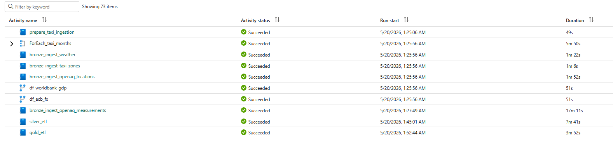
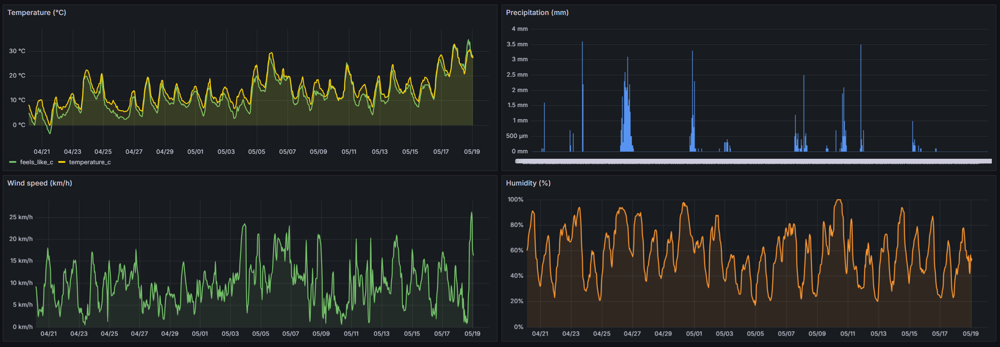

# How to Run the Project

## Prerequisites

1. **Microsoft Fabric trial or paid capacity** (F64 minimum for full features)
   - Activate at: https://app.fabric.microsoft.com → Start trial
2. **Microsoft account** with Fabric access (M365 or Azure AD)
3. **This git repository** — for storing Fabric workspace items, IaC, and documentation

---

## Step 0 — Provision Infrastructure (Terraform)

All Fabric resources (workspace, lakehouses, warehouse) are managed via Terraform. Never create them manually through the UI.

1. Install prerequisites: **Terraform >= 1.5**, **Azure CLI**
2. Create a Service Principal in Azure Entra ID and add it as **Admin** on the Fabric workspace
   (Manage Access → Add people or groups → paste SP application ID → Admin)
3. Fill in variables:
   ```bash
   cd terraform/
   cp terraform.tfvars.example terraform.tfvars
   # Edit terraform.tfvars: tenant_id, client_id, client_secret, capacity_id
   ```
4. Authenticate and apply:
   ```bash
   make login   # verify SP credentials
   make init    # download provider
   make apply   # create workspace + bronze_lakehouse + silver_lakehouse + gold_warehouse
   ```
5. Confirm outputs:
   ```bash
   make output  # shows workspace_id, lakehouse IDs, warehouse ID
   ```

Resources created:
- Workspace `Fabric NYC Analytics`
- `bronze_lakehouse`, `silver_lakehouse`
- `gold_warehouse`

---

## Step 1 — Connect Git (optional but recommended)

1. Workspace Settings → Git integration
2. Connect to this GitHub/Azure DevOps repo
3. Fabric will sync notebooks and pipeline definitions automatically

---

## Step 2 — Configure Data Ingestion (Bronze)

### 2a. NYC Taxi Pipeline

1. In workspace → New → **Data Pipeline** → name: `pl_ingest_nyc_taxi`
2. Add **Copy Data** activity:
   - Source: HTTP connector → URL pattern:
     `https://d37ci6vzurychx.cloudfront.net/trip-data/yellow_tripdata_YYYY-MM.parquet`
   - Sink: `bronze_lakehouse` → Files → `raw/taxi/`
3. Parameterize year/month for reuse
4. Test with one file (e.g., `2024-01`) before scheduling

### 2b. OpenAQ Locations Notebook

> Requires `OPENAQ_API_KEY` — register at https://openaq.org (free)

1. Sync repo via Fabric Git integration — `bronze_ingest_openaq_locations` notebook appears in workspace
2. Ensure `bronze_lakehouse` is the default attached lakehouse
3. Run with parameter `openaq_api_key` = your API key
4. Expected: ~24k+ global station records → `bronze_lakehouse.bronze_openaq_locations`

### 2e. OpenAQ Measurements Notebook

1. Sync repo via Fabric Git integration — `bronze_ingest_openaq_measurements` notebook appears in workspace
2. Ensure `bronze_lakehouse` is the default attached lakehouse
3. Run all cells — reads OpenAQ public S3 archive for all NYC stations (last 5 years) → `bronze_openaq_measurements`
4. Expected: ~1.1M rows across ~22 NYC stations

### 2c. World Bank GDP Dataflow Gen2

1. New → **Dataflow Gen2** → name: `df_worldbank_gdp`
2. Source: Web API → `https://api.worldbank.org/v2/country/all/indicator/NY.GDP.MKTP.CD?format=json&per_page=20000&date=2000:YYYY` where end year is dynamic (`DateTime.LocalNow() - 1` in M-code)
3. Navigate to second element of JSON array (index 1 contains data), convert to table
4. Expand records → keep: `country` (id, name), `date`, `value`
5. Rename: `country_code`, `country_name`, `year`, `gdp_usd`
6. Destination: `bronze_lakehouse` → Table: `bronze_gdp`

### 2d. ECB FX Dataflow Gen2

1. New → **Dataflow Gen2** → name: `df_ecb_fx`
2. Source: Web → `https://data-api.ecb.europa.eu/service/data/EXR/D.USD.EUR.SP00.A?format=csvdata`
3. Parse CSV, rename columns
4. Destination: `bronze_lakehouse` → Table: `bronze_fx_rates`

### 2f. TLC Taxi Zones Notebook

1. Sync repo via Fabric Git integration — `bronze_ingest_taxi_zones` notebook appears in workspace
2. Ensure `bronze_lakehouse` is the default attached lakehouse
3. Run all cells — downloads TLC `taxi_zone_lookup.csv` → `bronze_taxi_zones` Delta table
4. Expected: ~265 rows (static reference data, rarely changes; safe to run only on initial setup)

---

## Step 3 — Run Silver ETL Notebook

1. Sync `feature/data-orchestration` branch via Fabric Git integration — `silver_etl` notebook appears in workspace automatically
2. Open `silver_etl` notebook → attach `bronze_lakehouse` as additional data item (read source)
3. Default attached lakehouse must be **silver_lakehouse** (write target)
4. Run all cells top to bottom
5. Verify tables exist: `spark.sql("SHOW TABLES IN silver_lakehouse").show()`

```
Expected output tables:
  silver_lakehouse/Tables/silver_taxi_trips            (~2.87M rows, partitioned by year/month)
  silver_lakehouse/Tables/silver_openaq_locations      (~5k rows)
  silver_lakehouse/Tables/silver_openaq_measurements   (~1.1M rows, partitioned by year/month)
  silver_lakehouse/Tables/silver_gdp                   (~6.2k rows)
  silver_lakehouse/Tables/silver_fx_rates              (~7k rows)
```

---

## Step 4 — Run Gold ETL Notebook

1. Sync branch → `gold_etl` notebook appears in workspace automatically
2. Attach **silver_lakehouse** as data item (read source) and **gold_warehouse** as default (write target)
3. Run all cells — creates Fact and Dim tables in Warehouse

```
Expected tables in gold_warehouse:
  dbo.FactTaxiDaily
  dbo.FactAirQualityDaily
  dbo.DimDate
  dbo.DimZone
  dbo.DimFX
  dbo.DimGDP
```

---

## Step 5 — Build Visualizations

### 5a. Semantic Model (required before Power BI reports)

1. Open **gold_warehouse** in workspace → click **New semantic model**
2. Name: `nyc_analytics_model`, storage mode: **Direct Lake on SQL** → select all 6 tables → **Confirm**
3. Open the model → **Model** tab → add relationships:
   - `FactTaxiDaily[date_key]` → `DimDate[date_key]` (Many:1)
   - `FactTaxiDaily[fx_key]` → `DimFX[fx_key]` (Many:1)
   - `FactTaxiDaily[zone_key]` → `DimZone[zone_key]` (Many:1)
   - `FactAirQualityDaily[date_key]` → `DimDate[date_key]` (Many:1)
4. Add DAX measures to **FactTaxiDaily**: `Total Trips`, `Total Revenue USD`, `Total Revenue EUR`, `Avg Fare USD`, `Avg Trip Distance (mi)`, `Avg Trip Duration (min)`
5. Add DAX measures to **FactAirQualityDaily**: `Avg PM2.5`, `Avg NO2`, `Avg O3`
6. Sync back to Git: workspace → Source control → Commit

### 5b. Power BI Reports

1. In workspace → New → **Report** → pick `nyc_analytics_model` → **Create blank report** → save as `NYC Analytics`
2. Build **Mobility** page: KPI cards (Total Trips, Total Revenue USD, Avg Fare USD, Avg Trip Distance (mi)), year tile slicer, trips/day line chart, top 10 pickup zones bar chart
3. Build **Air Quality** page: KPI cards (Avg NO2, Avg O3, Avg PM2.5) with conditional fill color based on WHO 24h limits (Rules-based: green < safe / yellow = approaching / red > limit), year tile slicer, **Azure Maps** bubble visual (latitude/longitude from `FactAirQualityDaily`, Size & gradient color by Avg PM2.5, click filters trend chart and KPI cards), combined PM2.5+NO2+O3 daily line chart with WHO threshold Constant Lines (PM2.5=15 µg/m³, NO2=25, O3=100) and zoom slider, top 10 stations by Avg PM2.5 bar chart (does not respond to map clicks)
4. Build **Correlation** page: KPI cards (Total Trips, Avg PM2.5, Avg NO2) — PM2.5/NO2 cards share conditional fill rules with Air Quality page (use Format Painter to copy formatting), bar+line combo chart (Total Trips bars + Avg PM2.5 + Avg NO2 lines by month), year tile slicer (multi-select via Ctrl+click)
5. Build **Economic Impact** page: KPI cards (Total Revenue USD, Total Revenue EUR, USA GDP), clustered column chart (revenue USD vs EUR by year), line chart (USA GDP by year from DimGDP), line chart (USD/EUR exchange rate from DimFX)

---

## Step 6 — Master Orchestrator

1. Sync `feature/data-orchestration` branch — `pl_master_orchestrator` pipeline appears in workspace
2. Pipeline parameters: `year_start` (Int), `year_end` (Int), `force_refresh` (Bool, default false)
3. Activity structure:
   ```
   prepare_taxi_ingestion                   (Notebook — runs first, no dependencies)
                                              · Per-month HEAD check on TLC for each (year, month) in range
                                              · Skips months returning HTTP 403/404 (not yet published)
                                              · Lists Files/raw/taxi/ to exclude already-downloaded files
                                              · Outputs JSON list for ForEach via notebook exit value
                                              · Fails only if NO months in range are available at source
   [Parallel — all depend on prepare_taxi_ingestion Succeeded]
     df_ecb_fx                              (Dataflow Gen2)
     df_worldbank_gdp                       (Dataflow Gen2)
     bronze_ingest_taxi_zones               (Notebook, no parameters)
     bronze_ingest_openaq_locations         (Notebook, pass openaq_api_key)
       → bronze_ingest_openaq_measurements  (Notebook, depends on locations; pass year_start/year_end)
     ForEach (months from prepare) → pl_ingest_nyc_taxi (Pipeline, year/month from item())
   [Then]
     silver_etl                             (Notebook, pass year_start/year_end/force_refresh)
   [Then]
     gold_etl                               (Notebook, pass year_start/year_end/force_refresh)
   ```
4. Run with parameters `year_start=2023`, `year_end=2023` for single-year demo; `year_start=2022`, `year_end=2024` for full backfill. The `force_refresh` parameter cascades through the entire pipeline:
   - **`force_refresh=false` (default, used by scheduled runs)** — incremental processing throughout: `bronze_openaq_measurements` fetches only current + previous month from S3, `silver_openaq_measurements` MERGEs new rows past watermark, `silver_taxi_trips` appends only new `(year, month)` partitions, `FactAirQualityDaily`/`FactTaxiDaily` re-aggregate only last 7 days from `MAX(gold.date_key)`. Typical run: ~1-2 min total.
   - **`force_refresh=true` (manual backfill or recovery)** — full year-range rebuild for all layers; respects `year_start`/`year_end`. Typical run: ~15-22 min for 2-year range.
   - Partial years are supported — running for `year_end=2026` mid-year ingests only the months TLC has published (via `prepare_taxi_ingestion`).

### Typical activity durations

Measured on a full historical backfill (`year_start=2021`, `year_end=2026`, `force_refresh=True`) on 2026-05-20.

| Activity | Duration |
|----------|----------|
| prepare_taxi_ingestion | 49s |
| ForEach_taxi_months (12 months/yr, parallel) | ~5m 50s |
| Each ingest_taxi_month (Copy Data) | ~2m 0–10s |
| bronze_ingest_taxi_zones | ~1m 6s |
| bronze_ingest_weather | ~1m 22s |
| df_worldbank_gdp | ~51s |
| df_ecb_fx | ~51s |
| bronze_ingest_openaq_locations | ~1m 52s |
| bronze_ingest_openaq_measurements | ~17m 11s |
| silver_etl | ~7m 41s |
| gold_etl | ~3m 52s |

Notes:
- `bronze_ingest_openaq_measurements` is the dominant cost on long backfills — it's a serial S3 sweep per NYC station × year × month. The station-activity pre-filter (Batch 0, see `CLAUDE.md`) trims inactive station/year combinations.
- `silver_etl` and `gold_etl` scale with cumulative data volume — later years have more station/trip coverage.

Wall-clock end-to-end for the 6-year backfill: prepare_taxi_ingestion 1:25:06 → gold_etl finishes 1:56:36 = **~31 minutes** (bronze ingestions run in parallel; silver waits for bronze, gold waits for silver).



---

## Step 7 — Phase 7 External Stack (Docker Compose)

Phase 7 ships a local Docker Compose stack with three responsibilities:
- **`weather_sync`** — periodically copies `silver_weather` from Fabric SQL endpoint to InfluxDB
- **InfluxDB + Grafana** — time-series storage + dashboard for weather data
- **Telegram bot** — on-demand `/report` runs Great Expectations on Silver + Gold and replies with a summary

All four containers (`influxdb`, `grafana`, `app-weather-sync`, `app-bot`) are orchestrated by `docker-compose.yml` at the repo root. The same Python image (`Dockerfile`) is reused by both app containers via a multi-entry CLI (`python -m app {weather-sync,bot,ge-report}`).

### Prerequisites
- **Docker Desktop** (or any compose-compatible runtime)
- **GNU make** (Git Bash on Windows ships with it)

### 7a. Register an Entra ID Service Principal

The app reads from `silver_lakehouse` SQL endpoint and `gold_warehouse` via Microsoft Entra ID Service Principal authentication.

1. [portal.azure.com](https://portal.azure.com) → **Microsoft Entra ID** → **App registrations** → **New registration**
   - Name: `nyc-analytics-app` (any)
   - Account types: *Single tenant*
   - Redirect URI: leave blank → **Register**
2. From the Overview page copy the **Application (client) ID**
3. Sidebar → **Certificates & secrets** → **Client secrets** → **New client secret**
   - Description: `nyc-analytics-app`, Expires: 6 months → **Add**
   - Immediately copy the **Value** column (shown only once)
4. Enable the tenant setting **Service principals can call Fabric APIs**: Fabric portal → ⚙ Settings → **Admin portal** → **Tenant settings** → **Developer settings** → enable for entire org or a security group containing the SP. *(Requires Fabric admin role.)*
5. Add the SP to the workspace: Fabric portal → workspace **Fabric NYC Analytics** → **Manage access** → **+ Add people or groups** → paste the application ID → role **Viewer** → **Add**
6. Capture the SQL connection string: open `silver_lakehouse` → top-right toggle to **SQL analytics endpoint** → **⋯** → **Settings** → **SQL connection string**. The hostname looks like `<guid>.datawarehouse.fabric.microsoft.com`.

### 7b. Create a Telegram bot

1. In Telegram find **@BotFather** → `/newbot`
2. Choose a display name (any) and a username ending in `bot` (must be globally unique)
3. BotFather replies with an HTTP API token — copy it
4. (Optional, recommended) restrict bot to your chat: after first `/start`, find your chat ID in `make logs-bot` and set `TELEGRAM_ALLOWED_CHAT_IDS=<id>` in `.env`

### 7c. Fill `.env`

```bash
cp .env.example .env
# Edit .env — fill every value:
#   FABRIC_SQL_SERVER          (from 7a step 6)
#   FABRIC_SP_CLIENT_ID        (from 7a step 2)
#   FABRIC_SP_CLIENT_SECRET    (from 7a step 3)
#   INFLUXDB_TOKEN             (any 32+ char random string; will be created on first boot)
#   INFLUXDB_INIT_PASSWORD     (admin password for the InfluxDB UI)
#   GRAFANA_ADMIN_PASSWORD     (admin password for the Grafana UI)
#   TELEGRAM_BOT_TOKEN         (from 7b step 3)
```

### 7d. Build and start

```bash
make build          # first build ~2-3 min (downloads python:3.11-slim + MS ODBC Driver 18 + deps)
make up             # starts all 4 containers in background
make ps             # verify everything is "Up" and influxdb is "Up (healthy)"
```

### 7e. Verify weather pipeline

```bash
make weather-sync-once     # runs one-shot weather sync, exits when done
                           # output: "[weather_sync] wrote <N> points to weather_nyc"
```

Open Grafana on http://localhost:3000:
1. Login with `GRAFANA_ADMIN_USER` / `GRAFANA_ADMIN_PASSWORD` from `.env`
2. Sidebar → **Dashboards** → **NYC Weather**
3. Time range top-right — pick **Last 30 days** or **Last 6 months** (default 7 days may be empty due to Open-Meteo Archive's ~5-day lag)
4. Four panels should render: Temperature (with feels_like overlay), Precipitation (bars), Wind speed, Humidity



### 7f. Verify GE + Telegram bot

CLI smoke test (does not need the bot):
```bash
make ge-report     # runs all 12 suites, prints DQ report to stdout (~30-60 sec)
```

Bot smoke test:
1. Find your bot in Telegram by its `@username`
2. Send `/start` → bot replies with welcome text
3. Send `/report` → bot replies "Running DQ checks, please wait..." → ~30-60 sec later edits that message to show the full report wrapped in a `<pre>` block


The bot keeps running as long as the `app-bot` container is up (`restart: unless-stopped`). Logs: `make logs-bot`.

### Useful Make targets

```
make up              # start everything detached
make up-data         # start only influxdb + grafana (no app containers — for early smoke)
make down            # stop and remove containers (keeps volumes)
make clean           # stop AND delete volumes (destroys InfluxDB + Grafana data)
make rebuild         # force --no-cache build (use after dep changes)
make logs-bot        # tail bot logs
make logs-sync       # tail weather-sync logs
make weather-sync-once   # one-shot weather sync (exits on completion)
make ge-report       # one-shot DQ report to stdout
```

---

## Step 8 — Schedule Automation (Phase 6)

`pl_master_orchestrator` runs on a twice-daily schedule configured directly in Fabric UI.

### Schedule configuration

1. Workspace → `pl_master_orchestrator` → **Schedule** tab → **Add schedule**
2. Set **Every day**, times: **06:00** and **18:00**, timezone: **UTC**
3. Open **Parameters** for the schedule and set:
   - `year_start` (Int) → `2021`
   - `year_end` (Int) → current year (update annually each January)
   - `openaq_api_key` (SecureString) → your OpenAQ API key
   - `force_refresh` (Bool) → `false`
4. Toggle **On** → Save

### Why twice daily
- **06:00 UTC** — catches overnight ECB FX updates (~16:00 CET previous day) and OpenAQ measurements
- **18:00 UTC** — catches midday updates; provides afternoon dashboard refresh

### Why static year_start=2021
`prepare_taxi_ingestion` uses the year range only to detect *missing* bronze files — already-downloaded files are skipped (idempotent). With `force_refresh=false` all other layers (silver, gold) use incremental logic (watermarks / partition diffs / 7-day lookback) and ignore `year_start`/`year_end` entirely. Update `year_end` once per year when a new calendar year begins.

---

## Full Run Order (Manual)

```
Inside Fabric (one-shot replay of the full medallion):
  1. df_ecb_fx                              → bronze_fx_rates
  2. df_worldbank_gdp                       → bronze_gdp
  3. bronze_ingest_taxi_zones               → bronze_taxi_zones
  4. bronze_ingest_openaq_locations         → bronze_openaq_locations
  5. bronze_ingest_openaq_measurements      → bronze_openaq_measurements
  6. bronze_ingest_weather                  → bronze_weather
  7. pl_ingest_nyc_taxi (per year/month)    → Files/raw/taxi/
  8. silver_etl notebook                    → all silver_* tables (incl. silver_weather)
  9. gold_etl notebook                      → Fact/Dim tables in Warehouse
 10. Refresh Power BI                       → Reports update

In practice all of the above is one click: run `pl_master_orchestrator` (see Step 6).

External app (docker-compose, see Step 7):
 11. make weather-sync-once                 → silver_weather replicated to InfluxDB
 12. open Grafana on localhost:3000         → NYC Weather dashboard renders
 13. Telegram bot — /report                 → DQ report from Great Expectations
```

---

## Troubleshooting

| Issue | Fix |
|-------|-----|
| Dataflow Gen2 fails on OpenAQ pagination | Reduce `limit` to 500; check API key if using authenticated endpoint |
| Taxi Parquet file not found | URL uses 2-month lag — use files from 2+ months ago |
| Notebook can't write to silver_lakehouse | Ensure silver_lakehouse is the default attached lakehouse; use `notebookutils.lakehouse.get("bronze_lakehouse")` to build correct ABFS paths for cross-lakehouse reads |
| Warehouse table not visible in Power BI | Wait ~2 min after creation; refresh dataset connection |
| Delta Time Travel fails | Delta log may be expired (default 30 days retention); increase with `delta.logRetentionDuration` |
